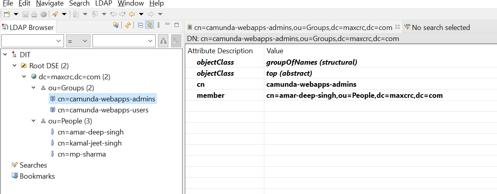

# camunda-springboot-ldap-integration
Securing Camunda webapps and REST API via LDAP users

## Prerequisites
* Java 15 Onwards, Java 17 preferred
* A running instance of LDAP example OpenLDAP, Microsoft Active Directory, Oracle Internet Directory

### How to run locally

1. Install OpenLDAP and configure. I have provided screenshots for LDAP config in this page only.
2. Review the configuration in application.yaml and make changes if required.

### How to install and configure OpenLDAP on Windows

1. Please follow this guide to install OpenLDAP :  https://www.maxcrc.de/en/openldap-for-windows-installation-en/

   Make sure you select Barkley DB for persistence while installation.
2. VERY IMPORTANT !!!! To enable the memberof overlay in OpenLDAP . This will make sure search based on memberOf are working.

   i. Open C:\OpenLDAP\slapd.conf file in notepad
   ii. Add below line in the end of file

   ``overlay memberof``
   
   iii. Restart the OpenLDAP service in Windows

4. Install Apache Directory Studio and use the same for creating at least two People and Two Groups. I am sharing screenshots using Apache Studio for reference.

   https://directory.apache.org/studio/

#### People : 

Details of Individual user :

#### Group :

### Run below command to start the project

   ``./mvnw clean package``

   ``./mvnw spring-boot:run``
   
Open your favorite browser and open the below URL to test

http://localhost:8080

## Bonus Content : How to configure it for Microsoft Active Directory 

I have added sample configuration file for MS AD , please refer that.

application.yaml-MDADexample is provided for reference.

## Dockerization and passing environment variables via ENV

1. Build the Docker image by following command in project root directory.

``docker build -t cambootldap .``

2. Make changes in ``application-openldap.env``  environment file.

I have given Spring boot equivalent of each environment variable in the application-openldap.env file.  

3. Run the Docker image using following command

``docker run -d -p 8080:8080 --env-file application-openldap.env --name camunda-container cambootldap``
